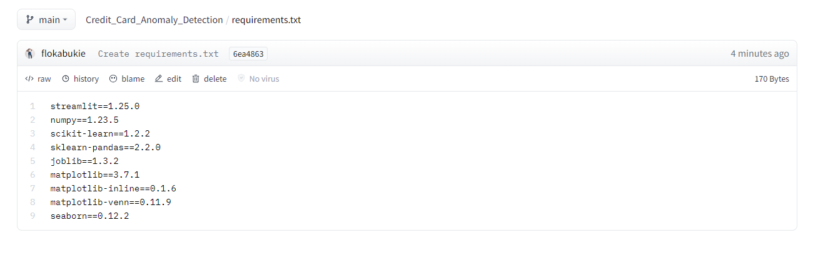

# Credit-Card-Fraud-Detection
 This project is to build an advanced fraud detection system using neural networks to identify transactions that appear unusual and potentially fraudulent. By applying object-oriented programming (OOPs) concepts, we aim to develop a scalable and modular solution that can handle large volumes of data and provide valuable insights to Company ABC.

### *Overview*
The Credit Card Anomaly Detection project focuses on identifying suspicious transactions within credit card data. Leveraging advanced machine learning algorithms, including Isolation Forest, DBSCAN, and Local Outlier Factor, this system provides an efficient solution for fraud detection.

### *Key Features*
**Multiple Algorithms**

Utilizes Isolation Forest, DBSCAN, and Local Outlier Factor for anomaly detection, allowing for comprehensive coverage.

**Data Preprocessing** 

Includes data scaling and standardization for improved model performance.

**Interactive Interface**

 A user-friendly interface enables easy input of transaction details for real-time anomaly detection.

**Visual Insights** 

Provides visualizations of anomaly scores and location plots for better understanding and decision-making.

### *Models*
**Isolation Forest:**
 A machine learning algorithm for detecting anomalies based on the fact that anomalies are typically far from the majority of data points.

**DBSCAN:**
 A density-based clustering algorithm that identifies regions with a high density of data points as clusters.

**Local Outlier Factor (LOF):** A method for detecting outliers in a dataset by measuring the local deviation of a given data point with respect to its neighbors.

### *Results*
Precision, recall, and AUC-PR scores for each model.

Visualizations demonstrating the performance and effectiveness of the algorithms.

### *Deployment*

This project includes a Streamlit web application that has been deployed on Hugging Face. 

Below are some screenshots of the app with all necessary files and running app

### *Installation*

Clone the repository:

Load the required dependencies:

### Dataset
Kindly find the dataset for this challenge [here](https://www.kaggle.com/datasets/iabhishekofficial/creditcard-fraud-detection)

## Summary
| Code      | Name        | ML Development Notebook|App Development| Deployed App | Medium Article |
|-----------|-------------|-------------:|-------------:|-------------|-------------|
| Credit Card Fraud Detection |Anomaly Detection| [Project Notebook](https://github.com/flokabukie/Credit-Card-Fraud-Detection/blob/main/CreditCardAnomalyDectection-ML-Anomaly%20(1).ipynb)  |[Streamlit App Notebook](https://huggingface.co/spaces/flokabukie/Credit_Card_Fraud_Detection/blob/main/app.py) |[Credit Card Fraud Detection with Streamlit](https://huggingface.co/spaces/flokabukie/Credit_Card_Fraud_Detection)|[Article](https://medium.com/@florentia.teye/detecting-credit-card-fraud-with-machine-learning-391d12c6efaa)

### *Contributing*
This project was prepared by Alidu Abubakar and Florentia Teye. Contributions are welcome! For major changes, please open an issue first to discuss what you would like to change. 

## **Authors**
#### **Florentia Teye**
Florentia Teye is a Data Scientist with experience in data analysis and machine learning. She has a Bachelor's of Education degree in Mathematics and has worked on several open-source projects. In her free time, she enjoys teaching, researching new niches and writing. If you have any questions or suggestions, feel free to reach out to her on GitHub or LinkedIn.

#### **Alidu Abubakar**

Alidu is a data analyst with over 5 years of experience in the engineering
sector with proficiencies in cloud computing (AWS, Google Cloud),
machine learning, data modeling and visualization, and extract,
transform, and load (ETL). He has experience with a variety of tools,
including Python, SQL, Excel, Power Query, Power Pivot, AWS
SageMaker, Power BI, and Google Looker. Alidu has successfully
completed a number of end-to-end Machine Learning projects and he occasionally generative AI solutions. Check out his profile on LinkedIn.

#### **You can interact with the deployed app via this link.** 

